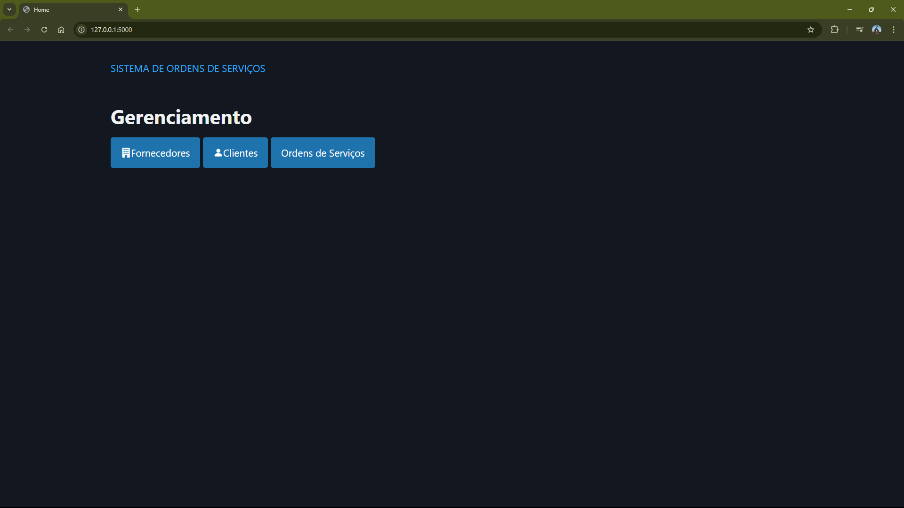
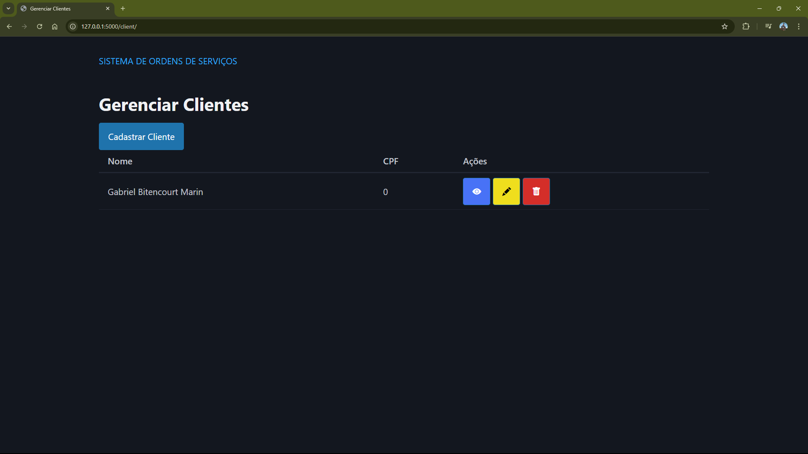
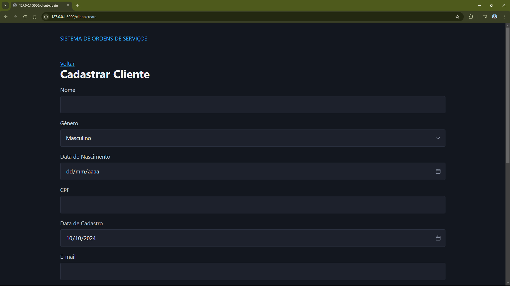
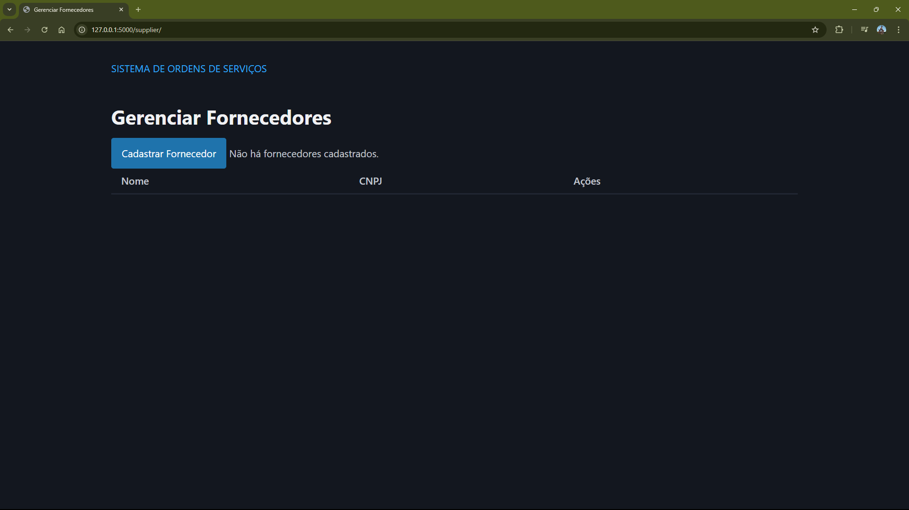
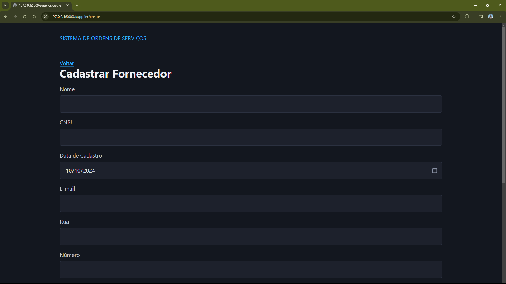
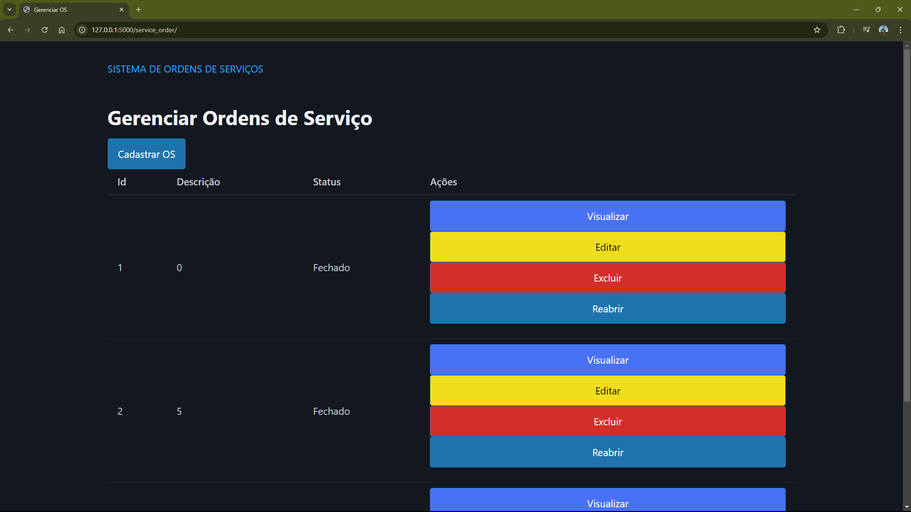
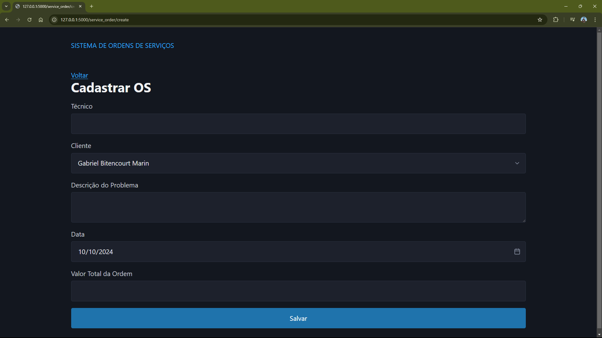

# sistema_ordens_servicos

SISTEMA DE ORDENS DE SERVIÇOS

## Requisitos

- [Python 3.12](https://www.python.org/) (Obrigatório)
- [PDM](https://github.com/pdm-project/pdm) (Opcional)

### Reprodução

#### Opção 1: via Pyprojectx

Para instalar o ambiente rode o seguinte commando:

```ps
./pw install
```

Depois, rode o servidor com o seguinte comando:

```ps
./pw start
```

#### Opção 2: via PDM

Para instalar o ambiente rode o seguinte commando:

```ps
pdm install
```

Depois, rode o servidor com o seguinte comando:

```ps
pdm start
```

#### Opção 3: via pip e venv

Crie o ambiente virtual:

```ps
python -m venv .venv
```

Ative o ambiente.

No Windows:

```ps
.venv\Scripts\activate
```

No Linux:

```sh
source .venv/bin/activate
```

Instale as dependências:

```ps
pip install -r requirements.txt
```

Rode o servidor:

```ps
flask run
```

## Telas














